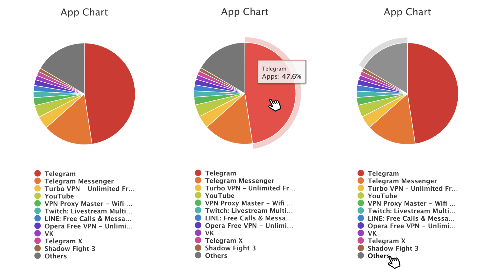

### Pie chart

#### В файле dataPieChart.json лежит массив данных о нескольких приложениях, пример приложения
```
{
    cnt: number, // количество упоминаний данного приложения
    title: string, // название приложения
}
```

#### Из данных в dataPieChart.json нужно отрендерить Pie Chart (см. картинку внизу):
1. Один элемент массива - один участок графика
2. При наведении на участок диаграммы появляется тултип, содержащий название приложения
    и процентное соотношение количества упоминаний приложения к общему количеству упоминаний всех приложений
    (137 упоминаний из 1000 - 13.7%)
3. Снизу под графиком находится список из всех приложений, наведениение на элемент списка подсвечивает соответствующий элемент на диаграмме

#### Необходимый стек технологий:
* React (можно использовать create-react-app, а не писать конфиг самому)
* react-highcharts (по этой ссылке, т.к есть одноименная библиотека) https://github.com/kirjs/react-highcharts
* ES6

#### Требования:
* Делать в этом или любом другом репозитории
* Весь код залит на публичный репозиторий github
* После клонирования репозитория достаточно установить пакеты и запустить приложение для его корректной работы
* production билд не нужен, достаточно development

#### Что будет проверяться:
* Отсутсвие антипаттернов для react & react-highcharts
* Корректная работа и отображение данных графика

#### Пример:
1. Общий вид графика
2. Наведение на участок диаграммы с тултипом
3. Наведение на элемент Other списка приложений

